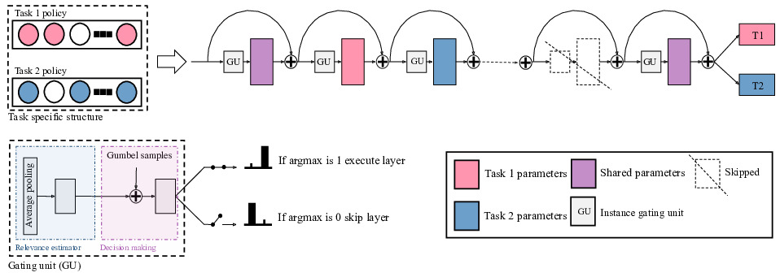

# DynaShare: Task and Instance Conditioned Parameter Sharing for Multi-Task Learning

## Introduction


In this paper (DynaShare), we extend the task-conditioned parameter sharing approach pioneered by AdaShare, and condition parameter sharing on both the task and the intermediate feature representations. **DynaShare** learns a hierarchical gating policy consisting of a task-specific policy for coarse layer selection and gating units for individual input instances, which work together to determine the execution path at inference time. Experiments on the **NYU v2**, **Cityscapes** and **MIMIC-III** datasets demonstrate the superiority and efficiency of the proposed approach across problem domains.

<!--Here is [the link](https://arxiv.org/pdf/1911.12423.pdf) for our arxiv version. 

Welcome to cite our work if you find it is helpful to your research.
```
@article{sun2020adashare,
  title={Adashare: Learning what to share for efficient deep multi-task learning},
  author={Sun, Ximeng and Panda, Rameswar and Feris, Rogerio and Saenko, Kate},
  journal={Advances in Neural Information Processing Systems},
  volume={33},
  year={2020}
}
```
-->

##  Experiment Environment

Our implementation is in Pytorch. We train and test our model on 1 `Quadro RTX 5000` GPU for `NYU v2 2-task` and `CityScapes 2-task`. 

We use `python3.6` and  please refer to [this link](https://docs.conda.io/projects/conda/en/latest/user-guide/tasks/manage-environments.html#creating-an-environment-with-commands) to create a `python3.6` conda environment.

Install the listed packages in the virual environment:
```
conda install pytorch torchvision cudatoolkit=10.2 -c pytorch
conda install matplotlib
conda install -c menpo opencv
conda install pillow
conda install -c conda-forge tqdm
conda install -c anaconda pyyaml
conda install scikit-learn
conda install -c anaconda scipy
pip install tensorboardX
```

## Datasets

### MIMIC3

This dataset is not public available, so you need to submit a request to work with this data
at [https://mimic.mit.edu/iii/gettingstarted/](https://mimic.mit.edu/iii/gettingstarted/). We followed the
pre-processing steps available
here: [https://github.com/YerevaNN/mimic3-benchmarks](https://github.com/YerevaNN/mimic3-benchmarks) and saved the
results in a folder named `mimic_dataset`.

## Training
### Policy Learning Phase

Please execute train.py for policy learning, using the command:
```
python train.py --config yamls/adashare/mimic_iii_4tasks.yml --gpus 0
```
### Policy Learning Phase new policy learning 
```
python train_policy_learning.py --config yamls/adashare/mimic_iii_4tasks_aig.yml --gpus 1
```

## Retrain Phase
After Policy Learning Phase, we sample 8 different architectures and execute re-train.py for retraining. 
```
python re-train.py --config <yaml_file_name> --gpus <gpu ids> --exp_ids <random seed id>
```
### Retrain Phase AIG
```
python re-train.py --config yamls/adashare/mimic_iii_4tasks_aig.yml --gpus 1 --exp_ids 2
```

<random seed id>, shows the seed index in the config file.

## Test Phase
After Retraining Phase, execute test.py for get the quantitative results on the test set.
```
python test.py --config <yaml_file_name> --gpus <gpu ids> --exp_ids <random seed id>
```

and example of using different seed for mimic dataset:
```
python test.py --config yamls/adashare/mimic_iii_4tasks.yml --gpus 0 --exp_ids 2
```


## NYU v2 and CityScapes


For full training and testing access to DynaShare on NYU v2 and Cityscapes access DynaShare folder.

```
cd DynaShare/
```

Please download the formatted datasets for `NYU v2` [here](https://drive.google.com/file/d/11pWuQXMFBNMIIB4VYMzi9RPE-nMOBU8g/view?usp=sharing) 

The formatted `CityScapes` can be found [here](https://drive.google.com/file/d/1WrVMA_UZpoj7voajf60yIVaS_Ggl0jrH/view?usp=sharing).

<!--Download `Tiny-Taskonomy` as instructed by its [GitHub](https://github.com/StanfordVL/taskonomy/tree/master/data).

The formatted `DomainNet` can be found [here](https://drive.google.com/file/d/1qVtPnKX_iuNXcR3JoP4llxflIUEw880j/view?usp=sharing).-->

Remember to change the `dataroot` to your local dataset path in all `yaml` files in the `./yamls/`.

## Training
### Policy Learning Phase
Please execute `train.py` for policy learning in **Train_AdaShare** folder, using the command 
```
python train.py --config <yaml_file_name> --gpus <gpu ids>
```
For example, `python train.py --config yamls/adashare/nyu_v2_2task.yml --gpus 0`.

Sample `yaml` files are under `yamls/adashare`

**Note:** The train phase is exactly the same as Adashare paper [the link](https://arxiv.org/pdf/1911.12423.pdf).
<!--**Note:** use `domainnet` branch for experiments on DomainNet, i.e. `python train_domainnet.py --config <yaml_file_name> --gpus <gpu ids>`-->

### Retrain Phase
After Policy Learning Phase, we sample 8 different architectures and execute `re-train.py` for retraining.
```
python re-train.py --config <yaml_file_name> --gpus <gpu ids> --exp_ids <random seed id>
```
where we use different `--exp_ids` to specify different random seeds and generate different architectures. The best performance of all 8 runs is reported in the paper.

For example, `python re-train.py --config yamls/adashare/nyu_v2_2task_aig.yml --gpus 0 --exp_ids 0`. 

<!--**Note:** use `domainnet` branch for experiments on DomainNet, i.e. `python re-train_domainnet.py --config <yaml_file_name> --gpus <gpu ids>`-->


## Test/Inference
After Retraining Phase, execute `test.py` for get the quantitative results on the test set. 
```
python test.py --config <yaml_file_name> --gpus <gpu ids> --exp_ids <random seed id>
```
For example, `python test.py --config yamls/adashare/nyu_v2_2task_test.yml --gpus 0 --exp_ids 0`.
